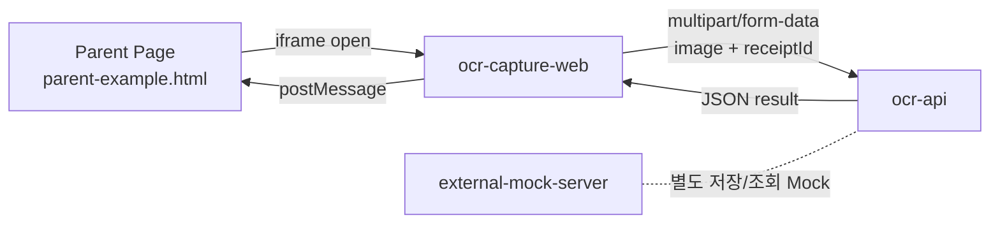

# OCR Scanner Project Analysis

## 1. 프로젝트 개요

이 저장소는 "자동차등록증 OCR" 흐름을 실험하거나 시연하기 위한 멀티 프로젝트 워크스페이스다. 현재 기준으로는 크게 3개의 실행 단위와 1개의 데모 HTML로 구성된다.

- `ocr-capture-web`: 사용자가 카메라 촬영 또는 파일 업로드로 자동차등록증 이미지를 입력하는 프런트엔드
- `ocr-api`: 업로드된 이미지/PDF를 받아 OCR을 수행하고 필드를 반환하는 백엔드 API
- `external-mock-server`: OCR 결과를 외부 시스템처럼 저장/조회하는 별도 Mock 서버
- `parent-example.html`: iframe + `postMessage` 방식으로 프런트 앱을 연동하는 부모 페이지 예제

즉, 전체 구조는 "입력 UI -> OCR API -> 결과 전달"을 중심으로 구성되어 있고, `external-mock-server`는 현재 직접 연결되기보다는 향후 외부 연동용 Mock 시스템으로 분리되어 있는 상태다.

## 2. 최상위 구조

| 경로 | 역할 | 현재 상태 |
| --- | --- | --- |
| `external-mock-server` | PostgreSQL 기반 OCR 결과 저장/조회 Mock 서버 | 독립 실행 가능 |
| `ocr-api` | NestJS 기반 OCR 분석 API | 실제 OCR 로직 포함 |
| `ocr-capture-web` | Vue 3 + Vite 기반 캡처/업로드 UI | iframe 연동 포함 |
| `parent-example.html` | 부모 페이지 데모 | 수동 테스트용 |
| `.claude` | 로컬 도구 설정 | 앱 로직과 직접 무관 |

현재 워크스페이스에는 `node_modules`, `dist`, `.env` 같은 실행 산출물/로컬 파일도 함께 존재한다. 즉 "소스만 있는 초기 템플릿"이 아니라 한 번 이상 직접 실행 및 빌드가 이루어진 작업 디렉터리로 보인다.

## 3. 전체 아키텍처

### 실제 동작 중심 해석

1. 부모 페이지가 `ocr-capture-web`을 iframe으로 연다.
2. 사용자는 카메라 촬영 또는 파일 첨부를 선택한다.
3. 프런트는 `receiptId`를 생성하고 파일을 `ocr-api`로 전송한다.
4. `ocr-api`는 OCR 수행 후 `carNumber`, `carName`, `vin`, `ownerName` 등을 응답한다.
5. 프런트는 완료/실패를 `postMessage`로 부모 페이지에 전달한다.
6. 부모 페이지는 전달받은 OCR 결과로 입력 폼을 채운다.

`external-mock-server`는 이 흐름에 현재 직접 끼어 있지 않다. 구조상 "외부 시스템에 결과를 저장하고, 나중에 `receiptId`로 조회"하는 시나리오를 위한 별도 축으로 이해하는 것이 맞다.

## 4. `ocr-capture-web` 상세 분석

### 4.1 역할

사용자 입력을 받는 모바일형 UI다. 쿼리 파라미터 `?mode=camera` 또는 `?mode=upload`에 따라 카메라 촬영 화면과 파일 업로드 화면으로 나뉜다.

### 4.2 기술 스택

- Vue 3
- TypeScript
- Vite
- Tailwind CSS
- `uuid`
- 브라우저 기본 `fetch`
- 브라우저 `getUserMedia`

### 4.3 주요 설정

| 파일 | 의미 |
| --- | --- |
| `ocr-capture-web/package.json` | `dev`, `build`, `preview` 스크립트 |
| `ocr-capture-web/vite.config.ts` | 개발 서버 포트 `3339`, `@` 별칭 설정 |
| `ocr-capture-web/tsconfig.json` | `strict: true`, `@/*` 경로 별칭 |
| `ocr-capture-web/tailwind.config.js` | Tailwind 스캔 경로 |
| `ocr-capture-web/postcss.config.js` | Tailwind + Autoprefixer |
| `ocr-capture-web/.env.example` | API URL, 부모 origin 예시 |

환경 변수는 아래 2개가 핵심이다.

- `VITE_OCR_API_URL=http://localhost:3000`
- `VITE_PARENT_ORIGIN=http://localhost:8080`

### 4.4 디렉터리 구조

| 경로 | 역할 |
| --- | --- |
| `ocr-capture-web/src/App.vue` | `mode`에 따라 뷰 분기 |
| `ocr-capture-web/src/views/CaptureView.vue` | 카메라 촬영 플로우 |
| `ocr-capture-web/src/views/UploadView.vue` | 파일 업로드 플로우 |
| `ocr-capture-web/src/composables/useCamera.ts` | 카메라 시작/정지/크롭 캡처 |
| `ocr-capture-web/src/composables/useOcr.ts` | OCR API 호출 |
| `ocr-capture-web/src/composables/usePostMessage.ts` | 부모 창 통신 |
| `ocr-capture-web/src/components/GuideFrame.vue` | 촬영 가이드 프레임 |
| `ocr-capture-web/src/components/ImagePreview.vue` | 촬영 후 미리보기 |
| `ocr-capture-web/src/components/LoadingOverlay.vue` | 업로드/분석 중 표시 |
| `ocr-capture-web/src/types/ocr.ts` | 응답/메시지 타입 정의 |
| `ocr-capture-web/src/utils/queryParams.ts` | `mode` 파라미터 해석 |

### 4.5 사용자 플로우

#### 카메라 모드

1. `CaptureView.vue`가 마운트되면 `initCamera()` 실행
2. `useCamera.ts`가 후면 카메라 우선으로 `getUserMedia()` 호출
3. `GuideFrame` 영역 좌표를 기준으로 현재 영상 프레임을 잘라 JPEG Blob 생성
4. `uuid`로 `receiptId` 생성
5. `useOcr.ts`가 `FormData(image, receiptId)`를 `ocr-api`로 POST
6. 응답이 `COMPLETED`이면 부모 창으로 `VEHICLE_REGISTRATION_OCR_COMPLETED` 메시지 전송
7. 실패 시 `VEHICLE_REGISTRATION_OCR_FAILED` 전송 후 토스트 표시

#### 업로드 모드

1. 숨겨진 `<input type="file">`를 트리거
2. 허용 타입과 10MB 제한을 프런트에서 1차 검증
3. 이미지면 미리보기 표시, PDF면 아이콘 + 파일명 표시
4. 사용자가 분석 시작 버튼 클릭
5. 이후 흐름은 카메라 모드와 동일

### 4.6 상태 관리 방식

전역 스토어는 없다. 각 화면이 `ref`와 컴포저블 조합으로 상태를 직접 가진다.

- 공통 상태 타입: `idle`, `capturing`, `preview`, `uploading`, `done`, `error`
- API 업로드 상태: `useOcr.ts` 내부 `isUploading`, `ocrError`
- 카메라 상태: `useCamera.ts` 내부 `isReady`, `cameraError`

소규모 데모나 임베드 UI로는 단순하고 적절하지만, 플로우가 늘어나면 화면별 상태 전이가 분산될 가능성이 있다.

### 4.7 장점

- 구조가 단순해서 읽기 쉽다.
- 카메라/업로드 플로우가 분리되어 있어 유지보수가 편하다.
- `postMessage` 기반이라 외부 부모 페이지에 쉽게 임베드 가능하다.
- `strict: true` 기반 TypeScript라 프런트 쪽 타입 안정성이 비교적 좋다.

### 4.8 확인된 리스크 및 불일치

#### 1) 성공 상태 UI가 사실상 비어 있음

`CaptureView.vue`, `UploadView.vue` 모두 OCR 성공 시 `state = 'done'`으로 전환하지만, `done` 상태 전용 템플릿 분기가 없다.  
그 결과 성공 이후 사용자가 보는 화면이 명확하지 않다.

#### 2) 부모 origin 검증이 성공/실패 경로에서 일관되지 않음

- `sendOcrCompleted()`는 `VITE_PARENT_ORIGIN`이 비어 있거나 `*`이면 전송을 막는다.
- `sendOcrFailed()`는 동일한 검증 없이 그대로 `postMessage()`를 실행한다.

실패 이벤트와 성공 이벤트의 보안/검증 기준이 다르다.

#### 3) 업로드 허용 타입과 API 허용 타입이 다름

프런트는 다음만 허용한다.

- `image/jpeg`
- `image/png`
- `image/webp`
- `application/pdf`

반면 `ocr-api`는 `image/heic`, `image/heif`도 허용한다.  
즉, 백엔드는 받는데 프런트는 선택조차 못 하게 되어 있다.

#### 4) iframe 오리진 의존성이 강함

- 프런트는 `VITE_PARENT_ORIGIN`이 정확히 맞아야 한다.
- 부모 예제는 `OCR_ORIGIN = 'http://localhost:3339'`를 기준으로 자식 메시지를 검증한다.

둘 중 하나라도 다르면 통신이 끊긴다. 실제 배포 시 가장 흔하게 문제 날 부분이다.

#### 5) 프록시가 없어서 CORS 설정 의존도가 높음

Vite 프록시가 없기 때문에 프런트는 언제나 실제 API 주소를 직접 호출한다.  
즉, 로컬/스테이징/운영 환경마다 `VITE_OCR_API_URL`과 백엔드 `ALLOWED_ORIGINS`를 정확히 맞춰야 한다.

## 5. `ocr-api` 상세 분석

### 5.1 역할

OCR 분석의 핵심 백엔드다. 현재는 자동차등록증 분석 하나에만 초점이 맞춰져 있으며, 업로드 파일을 받아 필요한 필드를 추출한 뒤 JSON으로 반환한다.

### 5.2 기술 스택

- NestJS 10
- TypeScript
- Multer (`memoryStorage`)
- `class-validator`, `class-transformer`
- `tesseract.js`
- `sharp`
- `pdf-parse`

### 5.3 디렉터리 구조

| 경로 | 역할 |
| --- | --- |
| `ocr-api/src/main.ts` | Nest 앱 부트스트랩, CORS, ValidationPipe |
| `ocr-api/src/app.module.ts` | 루트 모듈 |
| `ocr-api/src/ocr/ocr.module.ts` | OCR 기능 모듈 |
| `ocr-api/src/ocr/ocr.controller.ts` | 업로드 엔드포인트 |
| `ocr-api/src/ocr/ocr.service.ts` | 파일 검증 + OCR 결과 포맷 |
| `ocr-api/src/ocr/dto/*` | 요청/응답 DTO |
| `ocr-api/src/ocr/providers/ocr-provider.interface.ts` | Provider 인터페이스 |
| `ocr-api/src/ocr/providers/tesseract-ocr.provider.ts` | 실제 OCR 구현 |
| `ocr-api/src/ocr/providers/mock-ocr.provider.ts` | 과거/보조용 Mock 구현 |

### 5.4 엔드포인트

현재 확인되는 핵심 엔드포인트는 하나다.

- `POST /ocr/vehicle-registration/analyze`

입력:

- multipart 파일 필드명: `image`
- body 필드: `receiptId` (UUID)

출력:

- `receiptId`
- `mappedData`
  - `carNumber`
  - `carName`
  - `vin`
  - `ownerName`
- `confidence`
- `status`

### 5.5 요청 처리 흐름

1. `OcrController`가 `FileInterceptor('image')`로 업로드 수신
2. 파일 크기 10MB 제한
3. MIME 타입이 이미지 또는 PDF인지 1차 필터링
4. `AnalyzeVehicleRegistrationDto`로 `receiptId` UUID 검증
5. `OcrService`에서 파일 존재/타입/크기 재검증
6. DI된 `OCR_PROVIDER`로 실제 OCR 수행
7. 결과를 `{ receiptId, mappedData, confidence, status }` 형태로 래핑해 반환

### 5.6 OCR 구현 방식

#### 현재 실제 연결된 Provider

`ocr.module.ts`에서는 `OCR_PROVIDER`에 `TesseractOcrProvider`를 연결하고 있다.  
즉, 현재 소스 기준으로는 Mock가 아니라 Tesseract 기반 OCR이 실제 동작 경로다.

#### 이미지 처리

`tesseract-ocr.provider.ts` 기준 흐름:

1. `sharp`로 그레이스케일, normalize, sharpen 전처리
2. `tesseract.js` worker(`kor`, `eng`) 실행
3. OCR 텍스트 추출
4. 정규식/라인 기반 파서로 자동차등록증 필드 매핑

#### PDF 처리

1. `pdf-parse`로 텍스트 추출 시도
2. 텍스트 기반 PDF면 바로 파싱
3. 이미지 기반 PDF면 OCR 렌더링을 하지 않고 빈 결과 반환

즉, PDF 지원은 "텍스트 PDF"에는 어느 정도 대응하지만, 스캔 이미지 PDF는 현재 제대로 처리하지 못한다.

### 5.7 필드 추출 방식

자동차등록증에서 아래 4개 값을 뽑도록 설계되어 있다.

- 차량번호
- 차명
- 차대번호(VIN)
- 소유자명

추출 방식은 대부분 정규식 + 라인 탐색이다.

- 차량번호: `12가3456`, `123가4567` 패턴 탐색
- 차명: `차명` 라벨 뒤 또는 다음 줄 값 탐색
- 차대번호: 10~17자리 영숫자, 최종적으로 17자리 VIN 패턴 탐색
- 소유자명: 한글 2~5자 기준 탐색

즉, 정형화된 문서를 전제로 한 규칙 기반 파싱이며, OCR 원문 품질이 흔들리면 정확도도 함께 흔들릴 가능성이 높다.

### 5.8 환경 설정

`ocr-api/.env.example`

- `PORT=3000`
- `ALLOWED_ORIGINS=http://localhost:3339,http://localhost:8080`

`main.ts` 기준 특징:

- `ALLOWED_ORIGINS`를 쉼표 기반으로 분리
- 등록되지 않은 브라우저 origin은 차단
- 허용 메서드: `POST`, `OPTIONS`
- 전역 `ValidationPipe` 사용

### 5.9 코드상 강점

- 업로드 검증이 컨트롤러와 서비스 두 단계로 들어가 있다.
- Provider 인터페이스를 둬서 OCR 엔진 교체가 가능하다.
- 한글/영문 동시 OCR 설정이 이미 들어가 있다.
- `eng.traineddata`, `kor.traineddata` 파일이 프로젝트 내부에 있어 개발 환경 재현 의도가 보인다.

### 5.10 확인된 리스크 및 주의점

#### 1) `package.json`과 실제 사용 의존성이 맞지 않음

소스에서는 아래 패키지를 직접 import/require 한다.

- `tesseract.js`
- `sharp`
- `pdf-parse`

하지만 `ocr-api/package.json`에는 이 의존성이 선언되어 있지 않다.

현재 작업 디렉터리의 `node_modules`에는 해당 패키지들이 존재하므로 로컬에서는 이미 설치된 상태로 보이지만, 새 환경에서 `npm install`만 하면 그대로 재현되지 않을 가능성이 높다.  
즉, 가장 큰 운영 리스크 중 하나는 "로컬에서는 되지만 다른 환경에서는 안 되는 상태"다.

#### 2) 응답의 `confidence`와 `status`가 실제 OCR 결과를 반영하지 않음

`OcrService`는 OCR 결과 내용과 무관하게 아래 값을 고정 반환한다.

- `confidence: 0.92`
- `status: 'COMPLETED'`

실제로 필드가 모두 빈 문자열이어도 성공처럼 보일 수 있다.

#### 3) 이미지 기반 PDF는 사실상 미지원

코드상 PDF는 받지만, 텍스트 추출이 안 되는 스캔형 PDF는 빈 결과를 반환한다.  
사용자 입장에서는 "PDF 지원"으로 보이지만 실제 체감은 제한적일 수 있다.

#### 4) 타입 안전성이 프런트보다 약함

`tsconfig.json`에서 아래 옵션이 꺼져 있다.

- `strictNullChecks: false`
- `noImplicitAny: false`

즉, 백엔드는 타입 엄격도가 낮아 장기적으로 유지보수 비용이 커질 수 있다.

#### 5) 테스트/문서/운영 부가 기능이 거의 없음

현재 확인 기준으로는 다음이 부족하다.

- 자동 테스트
- Swagger/OpenAPI
- 헬스체크
- 구조화된 에러 응답 규약
- 로깅/모니터링 전략

데모 수준에서는 괜찮지만 서비스화 단계에서는 바로 보강이 필요하다.

## 6. `external-mock-server` 상세 분석

### 6.1 역할

외부 시스템을 흉내 내는 저장/조회 서버다.  
OCR 결과를 `receiptId` 기준으로 저장하고, 나중에 같은 ID로 재조회할 수 있다.

즉, 이 프로젝트 내 직접 OCR 수행기는 아니고 "OCR 결과를 외부 시스템에 적재하는 시나리오"를 위한 별도 백엔드다.

### 6.2 기술 스택

- NestJS 10
- TypeScript
- Prisma 5
- PostgreSQL
- `@nestjs/schedule`

### 6.3 주요 구조

| 경로 | 역할 |
| --- | --- |
| `external-mock-server/src/main.ts` | CORS, 포트, ValidationPipe |
| `external-mock-server/src/app.module.ts` | `ScheduleModule`, `OcrResultModule` 등록 |
| `external-mock-server/src/ocr-result/ocr-result.controller.ts` | 생성/조회 API |
| `external-mock-server/src/ocr-result/ocr-result.service.ts` | TTL 포함 저장/조회 로직 |
| `external-mock-server/prisma/schema.prisma` | DB 스키마 |
| `external-mock-server/.env.example` | DB 및 CORS 예시 |

### 6.4 엔드포인트

- `POST /external/ocr-result`
- `GET /external/ocr-result/:receiptId`

POST DTO:

- `receiptId`: UUID
- `mappedData`: JSON
- `confidence`: 0~1
- `status`: 문자열

### 6.5 저장 로직

- `receiptId`는 unique
- 중복 저장 시 `409 Conflict`
- `expiresAt` 컬럼으로 TTL 관리
- 기본 TTL은 24시간
- 최대 TTL은 72시간으로 상한 제한
- 매시간 스케줄러가 만료 데이터 정리

### 6.6 Prisma 모델

`OcrResult` 테이블은 아래 속성을 가진다.

- `id`
- `receiptId`
- `mappedData` (`Json`)
- `confidence`
- `status`
- `createdAt`
- `expiresAt`

### 6.7 현재 위치와 한계

이 서버는 구조상 깔끔하지만, 현재 레포 내부에서 `ocr-api` 또는 `ocr-capture-web`이 이 서버를 직접 호출하는 코드는 확인되지 않는다.  
즉, 준비는 되어 있지만 실제 메인 플로우에는 아직 연결되지 않은 상태다.

## 7. `parent-example.html` 상세 분석

### 7.1 역할

iframe 기반 임베드 시나리오를 설명하는 최소한의 부모 페이지 예제다.  
실서비스 페이지 대신 OCR 화면을 여는 데모라고 보면 된다.

### 7.2 동작 방식

1. 사용자가 "촬영하기" 또는 "첨부하기" 클릭
2. iframe `src`를 `http://localhost:3339?mode=camera|upload` 형태로 설정
3. 자식 프레임에서 `postMessage`를 받음
4. `VEHICLE_REGISTRATION_OCR_COMPLETED`면 입력 필드 자동 채움
5. `VEHICLE_REGISTRATION_OCR_FAILED`면 alert 표시

### 7.3 특징

- 자식 origin을 `OCR_ORIGIN = 'http://localhost:3339'`로 엄격히 검증
- 카메라 권한을 위해 `iframe allow="camera"` 지정
- 결과 필드를 읽기 전용 input으로 표현

### 7.4 주의점

이 파일은 단독 정적 HTML일 뿐이므로, 실제 부모 페이지 origin이 `VITE_PARENT_ORIGIN`과 맞지 않으면 메시지를 받지 못한다.  
즉, 예제를 그대로 파일로 더블클릭해 여는 방식보다는 로컬 서버에서 특정 origin으로 띄우는 방식이 더 안전하다.

## 8. 프로젝트 간 연결 관계 정리

### 현재 실제 연결

- `ocr-capture-web` -> `ocr-api`
- `ocr-capture-web` -> 부모 페이지(`postMessage`)

### 현재 미연결

- `ocr-api` -> `external-mock-server`
- `ocr-capture-web` -> `external-mock-server`

즉, 이 저장소는 "입력 UI와 OCR API는 붙어 있고, 외부 저장 Mock는 따로 준비된 상태"라고 정리할 수 있다.

## 9. 현재 프로젝트 성숙도 평가

### 좋은 점

- 전체 흐름이 명확하다.
- 프런트/백엔드/외부 Mock가 역할별로 분리되어 있다.
- iframe 임베드 시나리오까지 고려되어 있다.
- OCR 전처리와 한글 인식까지 이미 시도하고 있다.

### 아직 데모/프로토타입 성격이 강한 이유

- 일부 성공/실패 상태가 UX적으로 완결되지 않았다.
- 실제 운영용 의존성 관리가 불안정하다.
- OCR 신뢰도와 상태 산정이 정교하지 않다.
- 이미지 PDF 처리 한계가 있다.
- 외부 Mock 서버가 아직 메인 플로우에 연결되지 않았다.
- 자동 테스트/운영 문서가 거의 없다.

## 10. 핵심 리스크 요약

우선순위가 높은 순서대로 정리하면 다음과 같다.

1. `ocr-api/package.json`과 실제 OCR 소스 의존성이 맞지 않아 새 환경 재현이 깨질 가능성
2. `status`, `confidence`가 고정값이라 성공/실패 의미가 약함
3. 프런트 `done` 상태 UI 부재
4. PDF 지원 문구 대비 실제 이미지 PDF 처리 한계
5. `postMessage`와 CORS가 환경 변수에 강하게 의존
6. 프런트/백엔드의 허용 파일 타입이 일부 불일치
7. `external-mock-server`가 아직 실제 플로우에 포함되지 않음

## 11. 추천 개선 순서

### 1단계: 실행 안정화

- `ocr-api/package.json`에 실제 사용 의존성 명시
- `.env.example`와 실제 포트/origin 조합 재검증
- 프런트 `done` 상태 화면 추가

### 2단계: 결과 신뢰도 개선

- OCR 결과가 비어 있을 때 `FAILED` 또는 부분 성공 상태 도입
- `confidence`를 실제 OCR 엔진 결과와 연결
- 이미지 PDF 처리 전략 추가

### 3단계: 시스템 연결 완성

- `ocr-api` 결과를 `external-mock-server`에 적재하는 흐름 설계
- `receiptId` 기준 폴링/콜백 시나리오 정의
- 부모 페이지 데모를 실제 연동 문서로 확장

### 4단계: 운영 품질 보강

- API 문서화
- 테스트 추가
- 헬스체크 및 로깅 정리
- 배포/실행 가이드 작성

## 12. 최종 정리

이 프로젝트는 "자동차등록증 OCR을 iframe으로 임베드 가능한 사용자 흐름"을 빠르게 보여 주기 위한 구조로는 충분히 좋은 출발점이다.  
특히 `ocr-capture-web`의 입력 UX, `ocr-api`의 OCR 파이프라인, `external-mock-server`의 외부 저장 시나리오가 역할별로 분리되어 있다는 점이 장점이다.

다만 현재는 데모에 가까운 상태이며, 실제 서비스나 팀 협업 기준으로는 다음 두 가지가 가장 중요하다.

- 실행 환경을 새로 재현해도 깨지지 않도록 의존성과 설정을 정리할 것
- OCR 결과의 성공/실패 의미를 실제 데이터 품질과 연결할 것

이 두 부분만 먼저 정리해도 프로젝트 완성도가 크게 올라갈 가능성이 높다.
